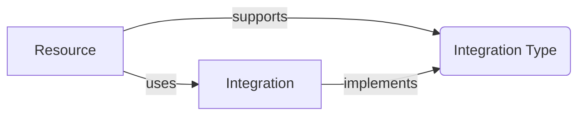

# Terminology

## Resource

A **Resource** is an instance of a service deployed in to your AWS account. Functionless extends the traditional concept of a Resource in Infrastructure-as-Code (IaC) by including the Business Logic along-side (or embedded within) the Infrastructure Code.

## Infrastructure Code

**Infrastructure Code** refers to code that only runs when your project is compiled and synthesized with the AWS CDK toolchain. It does not run as a part of your application, its only job is to define the configuration that will be deployed.

## Synthesis Time

We refer to **Synthesis Time** as the time when your [Infrastructure Code](#infrastructure-code) runs. This process is run locally or during CI/CD by the the `cdk deploy` and `cdk synth` CLI commands.

## Business Logic

Business Logic refers to code that implements a business requirement, for example the code within a Lambda Function determining how to handle an API request. In Functionless, this Business Logic is statically analyzed to automatically infer your Infrastructure's configuration. This is achieved by parsing the syntax and discovering function calls that interact with a Resource, for example calling `getItem` on a DynamoDB Table. These connections are called Integrations.

## Runtime

**Runtime** is when your [Business Logic](#business-logic) executes - for example, when your service invokes Lambda Functions, Step Functions, Appsync Resolvers, Event Bus Targets, etc.

## Integration

An Integration is a connection between two Resources, for example a Lambda Function calling a Resource's API such as `getItem` on a DynamoDB Table. All Integrations require IAM Policy Statements to authorize the connection and (depending on the context of the Integration) may require other configuration and runtime logic.

See the [Integration](./integration/) documentation for more information.

## Integration Context

An **Integration Context** refers to the context from which an Integration can be called from, for example from a Lambda Function (using imperative code) or from a Step Function (using declarative configuration). Not all contexts are supported by all Integrations.



All Integrations look the same - they are just function calls. The only difference is the surrounding context, such as within a `StepFunction` closure:

```ts
// event bus is a Resource
const bus = new EventBus<Event<{ name: string }>>(this, "bus");

// StepFunction is a Resource
const sfn = new StepFunction(this, sfn, async (payload: { name: string }) => {
  // bus.putEvents is an Integration that supports the StepFunction ASL Integration Type
  await bus.putEvents({
    source: "specialSource",
    "detail-type": "UserNameEvent",
    detail: payload,
  });
});
```

See the [Integration Context](./integration/index.md#integration-context) documentation for more information.

## TypeScript Transformer

The Functionless Transformer is a process that runs when you compile your TypeScript code to JavaScript. It re-writes parts of your code to include the [Functionless AST](#abstract-syntax-tree-ast).

## Abstract Syntax Tree (AST)

The Functionless AST is a data model representing a program's syntax. It is injected by the [Functionless Transformer](#typescript-transformer) and evaluated by an [Interpreter](#interpreter) during [Synthesis Time](#synthesis-time) to automatically configure infrastructure. See [How Integrations Work](../advanced-concepts/how-integrations-work.md#functionless-ast) for more information.

## Interpreter

An Interpreter is a process that runs during [Synthesis Time](#synthesis-time) to infer infrastructure configurations from the [AST](#abstract-syntax-tree-ast).

Examples include:

- [Amazon States Language](../api/asl-graph/classes/ASL-1.md)
- [Appsync Velocity Templates](../api/aws-appsync-constructs/classes/AppsyncVTL.md)
- [API Gateway Velocity Templates](../api/aws-apigateway-constructs/classes/APIGatewayVTL.md)
- [Event Bus Rules and Targets](../api/aws-events-constructs/classes/EventBus.md)
