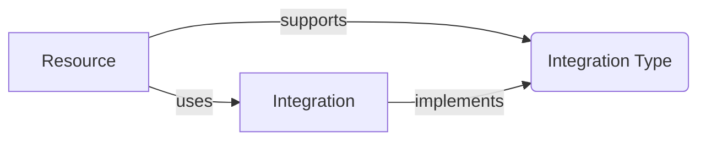

# Integration - Advanced

This section goes into detail on how [Integrations](../concepts/integration/) work. If you are just looking to use Functionless without extending it, this section can be skipped. If you have not read [Integrations](../concepts/integration/), do that first.

## Terms

- Resource - Infrastructure and Business Logic which use an integration, generally modelled as some infrastructure like a [`Function`](../concepts/function/) or [`EventBus`](../concepts/event-bridge/).
- [Integration](../concepts/integration/) - An object (may be a Resource) or function which can be used within a Resource.
- [Integration Type](./integration-types.md) - A pattern that an integration implements to be used within one or more Resources.



A view of what a user sees of Integrations and Resources:

```ts
// event bus is a Resource
const bus = new EventBus<Event<{ name: string }>>(this, "bus");

// StepFunction is a Resource
const sfn = new StepFunction(this, sfn, (payload: { name: string }) => {
  // bus.putEvents is an Integration that supports the StepFunction ASL Integration Type
  bus.putEvents({
    source: "specialSource",
    "detail-type": "UserNameEvent",
    detail: payload,
  });
});
```

Partial view of `EventBus` and `putEvents` which supports the StepFunction Integration Type:

```ts
class EventBus {

  public readonly putEvents: IntegrationCall<
    "EventBus.putEvents",
    IEventBus<E>["putEvents"]
  >;

  constructor(...) {
    // the makeIntegration method helps generate the right object and type for all integrations
    // also makes the property callable
    this.putEvents = makeIntegration<"EventBus.putEvents", IEventBus<E>["putEvents"]>({
      // ASL in an IntegrationType that requests a method of the form (call: CallExpr, context: ASL) => Omit<State, "Next">;
      asl: (call: CallExpr, context: ASL) => {
        // do things like grant permissions, generate ASL, and output a State object.
      }
    })
  }
}
```

On the `StepFunctions` side, it uses the `StepFunction` ASL Interface to extract the right data from the integrations. In this case its pretty simple.

When the Functionless compiler encounters an Integration, it wraps it in a [ReferenceExpr](../api/classes/ReferenceExpr.md).

The example with the `EventBus` and `StepFunction` above ends up looking like this after compilation:

```js
// event bus is a Resource
const bus = new functionless_2.EventBus(exports.stack, "bus");
// StepFunction is a Resource
new functionless_2.StepFunction(
  exports.stack,
  "sfn",
  new functionless_1.FunctionDecl(
    [new functionless_1.ParameterDecl("payload")],
    new functionless_1.BlockStmt([
      new functionless_1.ExprStmt(
        new functionless_1.CallExpr(
          new functionless_1.ReferenceExpr(
            "bus.putEvents",
            () =>
              // bus.putEvents is an Integration that supports the StepFunction ASL Integration Type
              bus.putEvents
          ),
          [
            new functionless_1.Argument(
              new functionless_1.ObjectLiteralExpr([
                new functionless_1.PropAssignExpr(
                  new functionless_1.StringLiteralExpr("source"),
                  new functionless_1.StringLiteralExpr("specialSource")
                ),
                new functionless_1.PropAssignExpr(
                  new functionless_1.StringLiteralExpr("detail-type"),
                  new functionless_1.StringLiteralExpr("UserNameEvent")
                ),
                new functionless_1.PropAssignExpr(
                  new functionless_1.StringLiteralExpr("detail"),
                  new functionless_1.Identifier("payload")
                ),
              ]),
              "event"
            ),
            new functionless_1.Argument(
              new functionless_1.ArrayLiteralExpr([]),
              "events"
            ),
          ]
        )
      ),
    ])
  )
);
```

During synthesis, when StepFunctions finds a [CallExpr](../api/classes/CallExpr.md), it checks to see if the call is on an Integration.

Instead of actually calling the Integration, it knows the implemented interface on the Integration and can call that instead.

```ts
if (isCallExpr(expr)) {
  // looks for a ReferenceExpr and returns the contents
  const integration = findIntegration(expr);

  // IntegrationImpl is a friendly wrapper around an integration that generates consistent failures.
  const integ = new IntegrationImpl(integration);
  // call the ASL method shown in the EventBus above.
  const state = integ.asl(expr, this);

  // add the state to the graph
}
```
