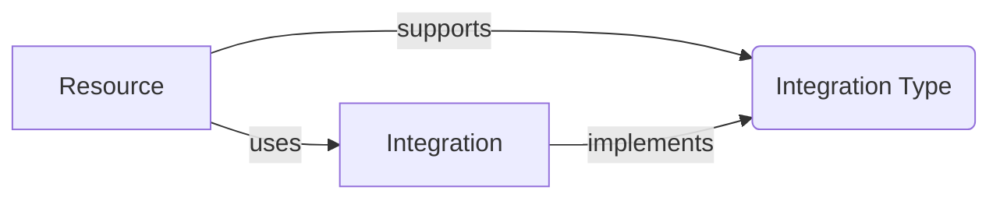

# Concepts

## Resource

A **Resource** is an instance of a service deployed in to your AWS account. Functionless extends the traditional concept of a Resource in Infrastructure-as-Code (IaC) by including the Business Logic along-side (or embedded within) the Infrastructure Code.

## Infrastructure Code

Infrastructure Code refers to code that only runs when your project is compiled and synthesized with the AWS CDK toolchain. It does not run as a part of your application, its only job is to define the configuration that will be deployed.

## Business Logic

Business Logic refers to code that implements a business requirement, for example the code within a Lambda Function determining how to handle an API request. In Functionless, this Business Logic is statically analyzed to automatically infer your Infrastructure's configuration. This is achieved by parsing the syntax and discovering function calls that interact with a Resource, for example calling `getItem` on a DynamoDB Table. These connections are called Integrations.

## [Integration](./concepts/integration/)

An Integration is a connection between two Resources, for example a Lambda Function calling a Resource's API such as `getItem` on a DynamoDB Table. All Integrations require IAM Policy Statements to authorize the connection and (depending on the context of the Integration) may require other configuration and runtime logic.

A Lambda Function requires an Environment Variable with the target Resource's ARN and an initialized SDK client for invoking API calls, for example an AWS SDK client. In "functionless" Resources, like Step Functions, configuration such as Amazon States Language (ASL) JSON is created instead.

The process of inferring these IAM Policies and automating any plumbing code is the responsibility of an Integration. The rest of this document describes each of the Integration types and how to implement your own.

## [Integration Context](./integration-types.md)

An **Integration Context** refers to the context from which an Integration can be called from, for example from a Lambda Function (using imperative code) or from a Step Function (using declarative configuration). Not all contexts are supported by all Integrations.



All Integrations look the same - they are just function calls. The only difference is the surrounding context, such as within a `StepFunction` closure:

```ts
// event bus is a Resource
const bus = new EventBus<Event<{ name: string }>>(this, "bus");

// StepFunction is a Resource
const sfn = new StepFunction(this, sfn, (payload: { name: string }) => {
  // bus.putEvents is an Integration that supports the StepFunction ASL Integration Type
  bus.putEvents({
    source: "specialSource",
    "detail-type": "UserNameEvent",
    detail: payload,
  });
});
```
