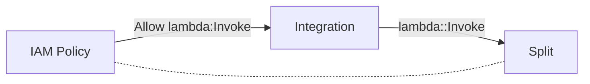

# Integration

An **Integration** is a connection between two services, for example an AWS Step Function calling a Lambda Function, or a Lambda Function writing to a DynamoDB Table, etc.

Integrations are a fundamental concept in building modern cloud applications. Cloud providers such as AWS provide services that manage integrations on your behalf, relieving you from scaling, operational and compliance responsibilities encountered in more traditional server-based applications.

A goal of Functionless is to make configuring integrations as simple as an ordinary function call, for example:

```ts
const split = new Function(this, "SplitString", (text: string) =>
  text.split(",")
);

new StepFunction(this, "Integration", (sentence: string) => {
  const words = await split(sentence);
  for (const word of words) {
    // etc.
  }
});
```

This code has two cloud services, an AWS Step Function and Lambda Function, and one integration where the Step Function invokes the `stringSplit` Lambda Function.



The Functionless compiler analyzes this code to: 1) automatically create a minimally permissive IAM Policy with access to invoke the `stringSplit` Lambda Function, and 2) generate the corresponding service configuration, in this case a Task State in Amazon States Language JSON (ASL).

All integrations in Functionless follow this same pattern. Using Functionless should feel like writing ordinary application code, no boiler-plate and no DSLs!
