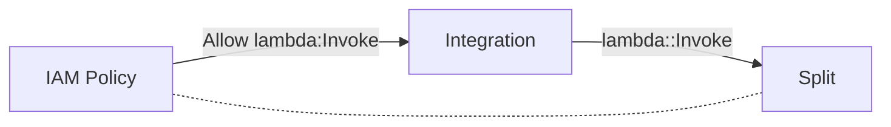

# Integration

## Introduction

An **Integration** is a connection between two services, for example an AWS Step Function calling a Lambda Function, or a Lambda Function writing to a DynamoDB Table.

Integrations are a fundamental concept in building modern cloud applications. Cloud providers such as AWS have services that manage integrations on your behalf, relieving you from scaling, operational and compliance responsibilities encountered in more traditional server-based applications.

## Integrations as Function Calls

Functionless makes configuring an Integrations as simple as calling a function, for example:

```ts
const split = new Function(this, "SplitString", (text: string) =>
  text.split(",")
);

new StepFunction(this, "Integration", async (sentence: string) => {
  const words = await split(sentence);
  for (const word of words) {
    // etc.
  }
});
```

This code has two cloud services, an AWS Step Function and Lambda Function, and one integration where the Step Function invokes the `stringSplit` Lambda Function.



The Functionless compiler analyzes this code to: 1) automatically create a minimally permissive IAM Policy with access to invoke the `stringSplit` Lambda Function, and 2) generate the corresponding service configuration, in this case a Task State in Amazon States Language JSON (ASL).

All integrations in Functionless follow this same pattern. Using Functionless should feel like writing ordinary application code, no boiler-plate and no DSLs!

## Supported Integrations

- [Function](../function) - the cloud's swiss army knife, an AWS Lambda Function. Functionless serializes in-line Function closures and automatically configures IAM Policies and Environment Variables, and initializes SDK clients (such as the AWS SDK) at runtime.
- [DynamoDB Table](../table.md) - a DynamoDB Table can be called from any functional integration, such as Function, Appsync Resolver, Step Function and Express Step Function.
- [Appsync Resolver](../appsync) - resolve fields in a GraphQL APi's Query, Mutation and Subscribe operations.
- [Step Function](../step-function/index.md#standard-step-function) - orchestrate long-running asynchronous workflows with AWS Step Functions.
- [Express Step Function](../step-function/index.md#express-step-function) - short-running synchronous or asynchronous workflows. Express Step Functions can often be a great replacement for intermediate Lambda Functions in APIs.
- [Event Bus Rule](../event-bridge/event-bus.md) - filter events flowing through an AWS Event Bridge Bus, optionally transform them and finally route them to a downstream integration, e.g. a Lambda Function, Step Function, SQS Queue, etc.

## Integration Context

An Integration can be called from various contexts, called an **Integration Context**. An Integration Context refers to how and where an API is called, for example from within a Lambda Function (called the **Native** context) or from within a Step Function (called the **Amazon States Language** context). Each Integration Context has its own constraints and domain-specific-language configurations that are compiled by Functionless from your TypeScript code.

All of the Integration Contexts supported by a particular Integration are provided by the `Integration` object. This object contains the following (below) properties. If a context is unsupported, then the corresponding property can be omitted and an error will be thrown during CDK synthesis.

| Name                           | Property     | Description                                                                                                                                                                                                                                                                                                                         | Caller Context                                                                                                            | Interface                                                                        |
| ------------------------------ | ------------ | ----------------------------------------------------------------------------------------------------------------------------------------------------------------------------------------------------------------------------------------------------------------------------------------------------------------------------------- | ------------------------------------------------------------------------------------------------------------------------- | -------------------------------------------------------------------------------- |
| Amazon States Language         | `asl`        | IAM Policies and a [Task](https://docs.aws.amazon.com/step-functions/latest/dg/amazon-states-language-task-state.html) definition in the Amazon States Language to invoke an Integration from within a [Step Function](../step-function#standard-step-function) or [Express Step Function](../step-function#express-step-function). | [`StepFunction`](../../api/classes/StepFunction.md) and [`ExpressStepFunction`](../../api/classes/ExpressStepFunction.md) | [None](https://github.com/functionless/functionless/issues/197)                  |
| API Gateway Velocity Templates | `apiGWVtl`   | IAM Policies, Velocity Templates (VTL) and [REST API Gateway Integration](https://docs.aws.amazon.com/apigateway/latest/developerguide/how-to-integration-settings.html) to handle a HTTP request by calling an Integration.                                                                                                        | [`AwsMethod`](../../api/classes/AwsMethod.md)                                                                             | [`AppSyncVtlIntegration`](../../api/interfaces/AppSyncVtlIntegration.md)         |
| App Sync Velocity Templates    | `appSyncVtl` | IAM Policies, Velocity Templates (VTL) and [App Sync Pipeline Resolver](https://docs.aws.amazon.com/appsync/latest/devguide/tutorials.html) used with AWS App Sync to invoke the Integration.                                                                                                                                       | [`AppsyncResolver`](../../api/classes/AppsyncResolver.md)                                                                 | [`AppSyncVtlIntegration`](../../api/interfaces/AppSyncVtlIntegration.md)         |
| Native Function                | `native`     | Creates IAM Policies, Environment Variables and initializes SDK clients for Integrations to be invoked within a lambda Function.                                                                                                                                                                                                    | [`Function`](../../api/classes/Function.md)                                                                               | [`NativeIntegration`](../../api/interfaces/NativeIntegration.md)                 |
| Event Bus                      | `eventBus`   | Create an [Event Bridge Target](https://docs.aws.amazon.com/eventbridge/latest/userguide/eb-targets.html) to (asynchronously) forward events matched by an [Event Bridge Rule](https://docs.aws.amazon.com/eventbridge/latest/userguide/eb-rules.html) to the Integration.                                                          | [`EventBus`](../../api/classes/EventBus.md)                                                                               | [`EventBusTargetIntegration`](../../api/interfaces/EventBusTargetIntegration.md) |
