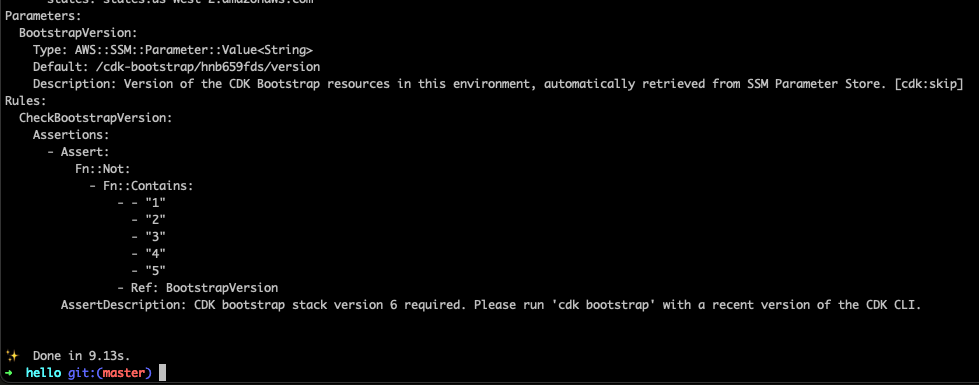

# Create New Project

We recommend creating new Functionless projects using the `create-functionless` template.
This template will generate a minimal project with the correct configuration so you can get started using Functionless quickly and easily.
To create a new project, run:

```bash
# For npm users:
npx create-functionless@latest
```

```bash
# For yarn users:
yarn create functionless
```

```bash
# For pnpm users:
pnpm create functionless
```

The template script will prompt for a project name and create the project in a new folder matching the name provided.
After the script completes:

- Run `cd <project-name>` to navigate to the root directory of the project.
- Verify the project is configured correctly by running `npm run synth` or `yarn synth` or `pnpm synth`.

You should see an output like the one below and the command should exit without error:



If you encounter an error, please let us know by [reaching out on discord][discord] or [creating an issue][create-issue].
Otherwise, it's time to take a closer look at the layout of your new project.

[discord]: https://discord.com/invite/VRqHbjrbfC
[create-issue]: https://github.com/functionless/functionless/issues/new
